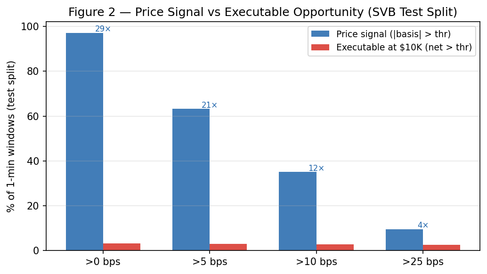
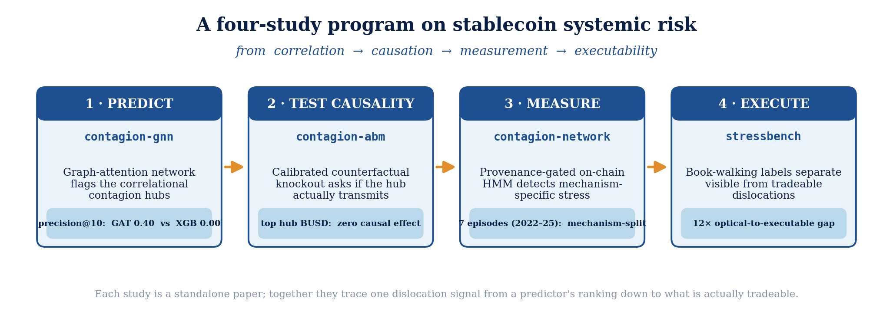
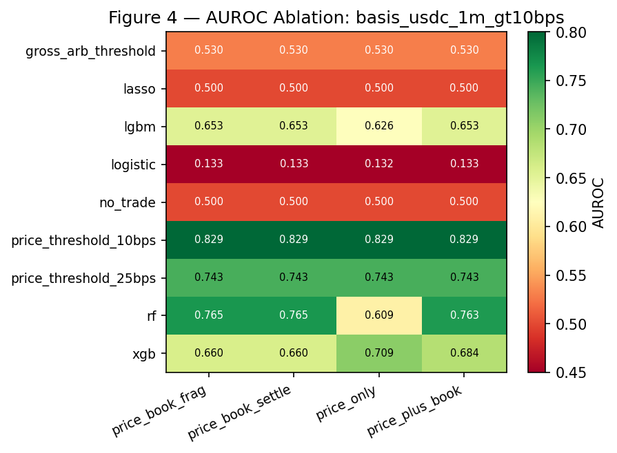
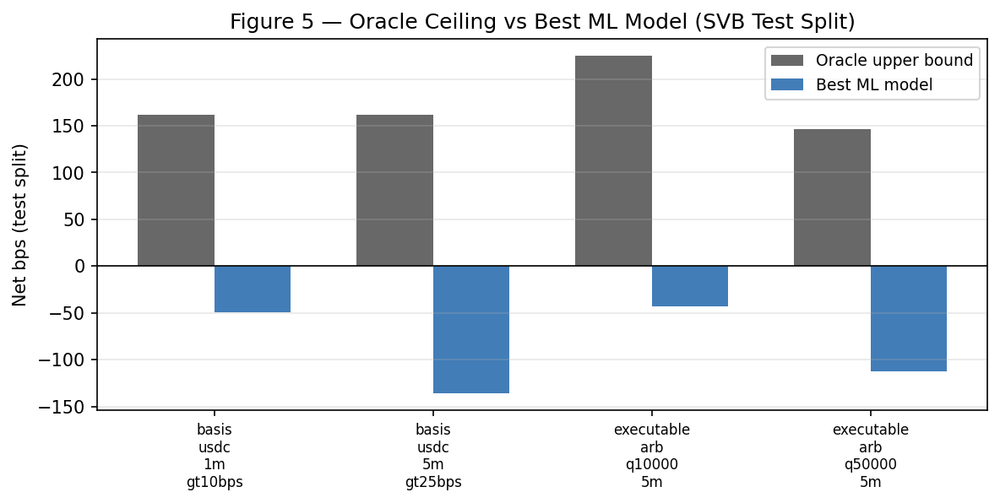

# Stablecoin StressBench

[](https://github.com/nl2992/ICAIF_stablecoin-stressbench/actions/workflows/ci.yml) [](LICENSE) [](environment.yml)

<p align="center">
  
</p>

<p align="center"><em>The core finding: only ~2.88% of optically-dislocated minutes survive VWAP book-walking, fees, and settlement — a 12× optical-to-executable gap on the CEX order book.</em></p>

**Stablecoin StressBench** is a transaction-cost-aware benchmark for detecting, forecasting, and economically ranking stablecoin dislocations across venues, quote currencies, and settlement rails.

This repository implements a full-featured, reproducible benchmark and research environment designed for evaluating machine learning and econometric models on stablecoin stress-testing and dislocation scenarios.

## Part of a coordinated four-study program

These four repositories trace one stablecoin-dislocation signal end-to-end — from a predictor's hub ranking down to what is actually tradeable. **This repo is study 4 (EXECUTE).**

<p align="center"></p>

*From correlation (GNN) → causation (ABM) → measurement (provenance-gated on-chain HMM) → executability (12× optical gap). Generated by `scripts/make_research_arc_figure.py`.*

---

## Research Objective

Can AI models identify stablecoin dislocations that are still economically meaningful after spreads, depth, fees, transfer frictions, and settlement risk are included?

Stablecoin StressBench is designed to test three hypotheses:
1. **Cross-quote and cross-venue dislocations** are measurable and severe during stablecoin stress events.
2. **Naive price-only signals overstate arbitrage** because they ignore executable depth, fees, latency, and transfer constraints.
3. **Joint feature models** (combining order-book state, cross-venue basis, stablecoin FX deviation, venue status, and on-chain settlement features) outperform price/candle-only baselines.

### Empirical results

During the SVB-crisis test window (March 2023), the current paper dataset shows **34.3% of 1-minute windows** with a primary/max cross-quote basis exceeding 10 bps on price alone (12.45% for the USDC-specific basis) — yet only **2.88% exceeded the $10K executable-profit threshold** after a VWAP order-book walk, taker fees, and market impact. This **12× price-to-execution gap** is the core quantitative claim of the benchmark. The frozen baseline table in `results/paper/table_2_price_execution_gap.csv` records the earlier benchmark-freeze view (35.09% primary/max; 12.65% USDC-specific).

The hindsight oracle yields **161–225 net bps per trade** across tasks, confirming profitable windows exist. Calm-trained rule and ML models remain economically weak: the frozen executable-arbitrage tasks are negative out of sample, while the current paper draft reports cross-mechanism meta-labeling trained on Terra/LUNA as the one positive transfer result (+82.5 bps on SVB). The benchmark is therefore about execution-aware transfer, not price-signal detection alone.

Full results: [`results/paper/table_2_price_execution_gap.csv`](results/paper/table_2_price_execution_gap.csv) · [`results/paper/table_4_oracle_gap.csv`](results/paper/table_4_oracle_gap.csv)

## Repository Structure

```text
stablecoin-stressbench/
  README.md
  pyproject.toml
  .env.example
  Makefile
  docker-compose.yml

  configs/               # YAML configurations for venues, instruments, event windows, fees
  src/stressbench/       # Source code for ingestion, normalization, book reconstruction, features, labels, models, evaluation
  sql/clickhouse/        # ClickHouse DDL schemas for dim, fact, feature, and label tables
  scripts/               # Operational scripts for data capture, pipeline building, training, and evaluation
  notebooks/             # Jupyter notebooks for analysis and visualization
  tests/                 # Pytest suite for core components
```

## Quick Start

### 1. Installation
```bash
python -m venv .venv
source .venv/bin/activate
pip install -e .
```

### 2. Build Bronze → Silver → Gold (historical data)
```bash
# Pull Binance Vision archive (public, no API key needed)
python scripts/pull_data.py --start 2023-03-10 --end 2023-03-15 \
  --venues binance --mode archive

# Pull Coinbase / Kraken via Tardis (requires TARDIS_API_KEY in .env)
python scripts/pull_data.py --start 2023-03-10 --end 2023-03-15 \
  --venues coinbase kraken --mode tardis

# Normalize Bronze to Silver, then build Gold feature tables
python scripts/build_features.py --start 2023-03-10 --end 2023-03-15
```

### 3. Run the experiment grid
```bash
# Train baseline models and evaluate across tasks × feature sets
python scripts/run_experiments.py --data-dir data/gold

# Results written to results/experiments/all_results.csv
```

### 4. Run Live Capture (optional)
```bash
python scripts/start_live_capture.py
```

### 5. Run tests
```bash
pytest tests/ -q
```

## Historical Event Catalogue

Stablecoin stress is a recurring phenomenon across multiple failure modes. The benchmark catalogues
**18 stress events** spanning 2020–2023 across **7 mechanism classes**:

| Mechanism class | Representative event | Tier | N |
|---|---|---|---|
| Algorithmic / Reflexive | Terra/UST May 2022 | B | 5 |
| **Fiat-Reserve Bank Shock** | **USDC/SVB Mar 2023 (stress + recovery)** | **A** | **2** |
| Regulatory / Issuer Winddown | BUSD Feb 2023 | B | 2 |
| Exchange Credit / Liquidity | FTX Nov 2022 | B | 3 |
| DeFi Pool Imbalance | USDT/Curve Jun 2023 | B | 3 |
| Collateral / Liquidation | DAI Black Thursday 2020 | B | 1 |
| RWA / Niche Stablecoin | USDR Oct 2023 | B | 2 |

Execution-aware arbitrage analysis (oracle gap, model evaluation) is anchored to the
USDC/SVB Tier A depeg and recovery windows where committed VWAP net-profit labels
and route-level depth provenance are available. Some route legs use proxy depth in
the committed dataset; Tier B magnitude figures carry "est." notation.

See [`docs/stablecoin_stress_event_catalog.md`](docs/stablecoin_stress_event_catalog.md) for
full event entries and [`configs/event_windows_historical.yaml`](configs/event_windows_historical.yaml)
for the authoritative machine-readable source.

## Documentation

- [Research Methodology](docs/research_methodology.md) — event-study design, execution-label construction, model stack, and empirical results summary
- [Historical Event Catalog](docs/stablecoin_stress_event_catalog.md) — 18 events across 7 mechanism classes with tier classification and source verification
- [Historical Methodology](docs/historical_methodology.md) — tier classification rules, claim permissions, source verification protocol
- [Data Card](docs/data_card.md) — dataset provenance, schema, and depth-source tagging
- [Benchmark Card](docs/benchmark_card.md) — tasks, metrics, splits, and current benchmark caveats
- [Reproducibility Manifest](docs/reproducibility_manifest.md) — step-by-step reproduction guide for baseline and add-on outputs

## License
MIT License


<!-- readme-enhanced -->
## Figures



*Calm-trained model families fail economically despite high AUROC (the AUROC–P&L inversion).*



*Hindsight-oracle ceiling vs captured profit: cross-mechanism meta-labeling recovers ~51% of the oracle on the real SVB test.*

## Reproduce (data → analysis → paper)

**Prerequisites.** Python 3.11. For the exact pinned environment use conda — `conda env create -f environment.yml && conda activate stressbench` — or with pip:
```bash
make install && cp .env.example .env   # add ETHERSCAN/TARDIS keys if pulling fresh
```

**End-to-end pipeline.** Each step writes versioned artifacts consumed by the next:

```bash
# 1. Pull raw venue data to the Bronze layer
make pull-archive

# 2. Build execution-aware features + VWAP book-walking labels
make build-features

# 3. Train the model ladder (tabular / sequence / RL / changepoint)
make train

# 4. Evaluate (oracle capture, transfer, supervision-format ablation)
make evaluate

# 5. Real multi-event on-chain AMM venue-specificity (CEX 12× vs AMM ~1×)
python scripts/run_onchain_amm_gap.py

# 6. (or) the whole pipeline in one command
make pipeline

```

### Reproduce the paper's headline numbers

`make pipeline` regenerates the core tables; the add-on results below are single scripts.
Each claim maps to one committed artifact. The RL ladder is seeded (`[42, 7, 13, 23, 2025]`).
See [`docs/reproducibility_manifest.md`](docs/reproducibility_manifest.md) for the full step-by-step.

| Paper claim | Command | Output artifact |
| --- | --- | --- |
| **34.3%** optical → **2.88%** executable = **12×** gap (SVB) — abstract, Tab. 2 | `make build-features && python scripts/make_paper_tables.py` | `results/paper/table_2_price_execution_gap.csv` |
| Hindsight-oracle ceiling **161–225** net bps/trade — Tab. 4 | `python scripts/make_paper_tables.py` | `results/paper/table_4_oracle_gap.csv` |
| Cross-mechanism transfer **+82.5 bps** (95% CI, **51%** oracle) — abstract | `python scripts/compute_meta_bootstrap_cis.py` | `results/paper_addon/table_bootstrap_claim_intervals_updated.csv` |
| AUROC–P&L inversion: highest-AUROC GRU is the largest money-loser — §results | `make train && make evaluate` | `results/experiments/all_results.csv` |
| Supervision format binds: binary **+82.5** vs PPO-GRU **−29.2 bps** — §supervision | `python scripts/run_supervision_format_ablation.py` | `results/experiments_addon/supervision_format_ablation.csv` |
| Venue specificity: CEX **12×** vs on-chain AMM **~1×** across 5 events — §gap | `python scripts/run_onchain_amm_gap.py` | `results/experiments_addon/onchain_amm_gap_multi.json` |

The compiled paper is **`paper/main.tex → paper/main.pdf`** (build: `cd paper && latexmk -pdf main.tex`).

**Exact reproduction.** Tested with Python 3.11. The committed `results/` artifacts are the exact published numbers; the RL ladder is seeded (`[42, 7, 13, 23, 2025]`). Raw market data under `data/` is gitignored and rebuilt from the public Binance Vision archive (no key required) and Coinbase/Kraken via Tardis (`TARDIS_API_KEY`); the public archive is stable, so the committed `results/` artifacts are canonical for the published figures. The benchmark itself is released under CC-BY 4.0 (see `LICENSE`, `DATA.md`).
